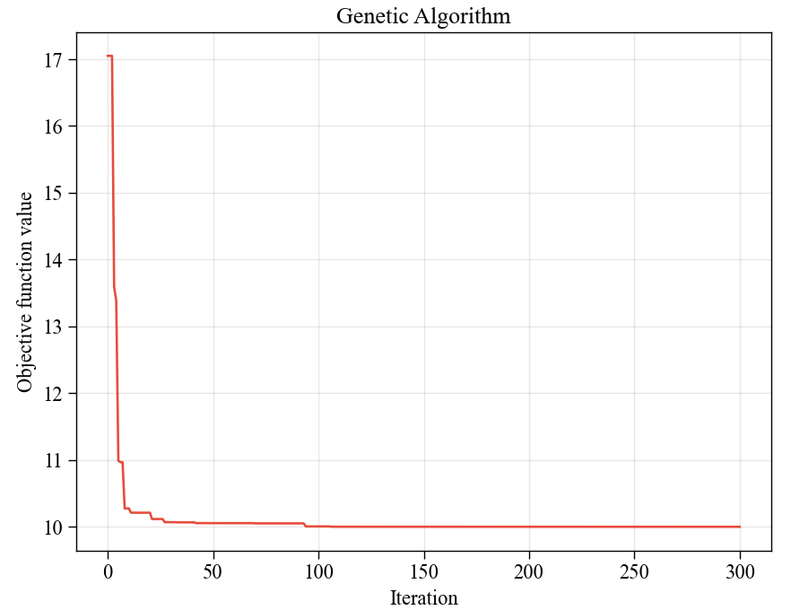

# :bird:遗传算法（Genetic Algorithm）

###  :arrow_forward:**1.前言**

本项目实现了能够添加各种约束条件（等式约束、不等式约束）下的规划模型遗传算法求解，同时可适用于连续变量、整型变量和01变量。

### :bookmark:**2.使用方法**

### :blue_book:**3.案例分析**

:key:**声明**

本项目基于rmsolgi的geneticalgorithm项目进行改进，从而实现各种约束条件下的目标规划求解(加入罚函数)，原始项目信息如下：<https://github.com/rmsolgi/geneticalgorithm>

