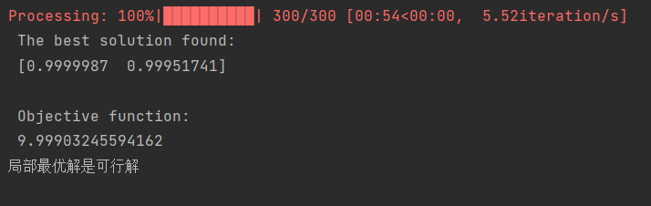

# :bird:**基于罚函数的遗传算法（Penalty-based Genetic Algorithm）**

###  :arrow_forward:**1.前言**

本项目实现了能够添加各种约束条件(等式约束、不等式约束)下的规划模型遗传算法求解（基于罚函数），同时可适用于连续变量、整型变量和01变量。

### :bookmark:**2.使用方法**

1. 使用git clone https://github.com/leost123456/Genetic-Algorithm.git 克隆到本地仓库，或者直接下载源码。
2. 进入目录终端输入指令pip install -r requirements.txt安装所需依赖。
3. 利用该遗传算法代码库求解设置的规划模型即可。

### :blue_book:**3.案例分析**

假设有如下的目标规划模型：


我们即可通过如下代码进行求解（代码中参数包括详细注释）：

```python
import numpy as np
from GA import GA

#设置目标哈数
def f(X):
    return X[0]**2+X[1]**2+8

#设置不等式约束条件（默认都是要小于等于0）
def ineq_constraints(X):
    #约束1
    cons1=X[1]-X[0]**2
    return [cons1]

#设置等式约束（默认都是要小于等于0）
def eq_constraints(X):
    #约束2
    cons2=-X[0]-X[1]**2+2
    return [cons2] #组合成序列的形式

if __name__ == '__main__':
    varbound = np.array([[0,100], [0, 100]])  # 变量值域范围
    #‘real’表示连续变量，‘int’表表示整型变量，如果01变量也是选择'int'，变量值域限制为01即可
    vartype = np.array([['real'],['real']])  # 连续变量类型

    #默认是最小化目标函数
    model = GA(function=f, #目标函数
               dimension=2, #决策变量数量
               variable_type=vartype, #变量类型（序列形式，real,int）
               variable_boundaries=varbound, #各变量值域
               eq_constraints=eq_constraints, #等式约束函数
               ineq_constraints=ineq_constraints, #不等式约束函数
               function_timeout=10, #延时（函数没响应）
               eq_cons_coefficient=0.001, #等式约束系数（值越小，等式约束越严格）
               max_num_iteration=300, #最大迭代次数
               population_size=1000, #个体数量（初始解的数量）
               penalty_factor=1, #惩罚因子（用于约束条件）,越大约束作用越大（要选择合适的值1比较合适）
               mutation_probability=0.1, #变异概率
               elit_ratio=0.01, #精英选择的比例（每轮都保留一定数量的较优目标函数的个体）
               crossover_probability=0.5, #交叉概率
               parents_portion=0.3, #父代比例(用于每代的交叉和变异)
               crossover_type='uniform', #交叉类型（”one_point“ ”two_point“ "uniform"）
               max_iteration_without_improv=None, #多少轮没更新后退出
               convergence_curve=True, #是否绘制算法迭代收敛曲线
               progress_bar=True, #进度条显示
               plot_path='.' #保存收敛曲线svg图像的路径
               )
    model.run()
    #输出信息
    best_variable=model.best_variable #最优解
    best_function=model.best_function #最优目标函数
    report=model.report #每轮的最优目标函数
```

最终的遗传算法迭代结果如下所示：


求解得到的最优解如下所示：



:key:**声明**

本项目基于rmsolgi的geneticalgorithm项目进行改进，从而实现各种约束条件下的规划模型求解(加入罚函数)，原始项目信息如下：<https://github.com/rmsolgi/geneticalgorithm>


